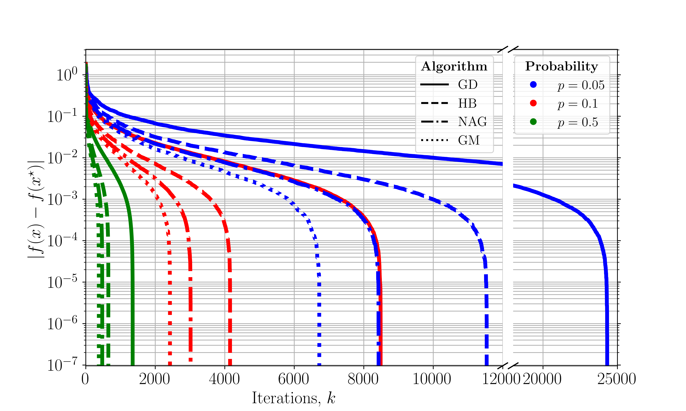

A Distributed Asynchronous Generalized Momentum Algorithm Without Delay Bounds Simulation 
============

This is the simulation for the "A Distributed Asynchronous Generalized Momentum Algorithm Without Delay Bounds" paper. The example data set used here is the Fashion-MNIST dataset. A multi-class logarithmic regression model is used for benchmarking.

Comparisons between algorithms with update and communication probabilities of 0.5, 0.1, and 0.05:

### How to run the simulation 
Set the variable on line 22 `recompte_true_cost` to `True` for the first run to generate the `true_cost.npy` file, this is used to save the optimal cost for comparison. Set this to `False` once the cost is calculated, and if any problem setting changes, this needs to be set to `True` again for the optimal cost to be re-calculated.

To change the update and communication probability, change the value of `probs` on line 237 to the desired probability (code can also be modified to take multiple values in the array). After the simulation finishes, `cost_diff_GD_prob={prob_pct}.npy`,`cost_diff_HB_prob={prob_pct}.npy`,`cost_diff_NAG_prob={prob_pct}.npy`, and `cost_diff_GM_prob={prob_pct}.npy` will be generated (`prob_pct` is the  update and communication probability in percentage form), which contain the distances of the calculated true cost to the optimal cost for each iteration. 

To replicate the convergence plot in the paper, run `sim_plotter.py` after the simulation is run and the numpy files are generated. 

